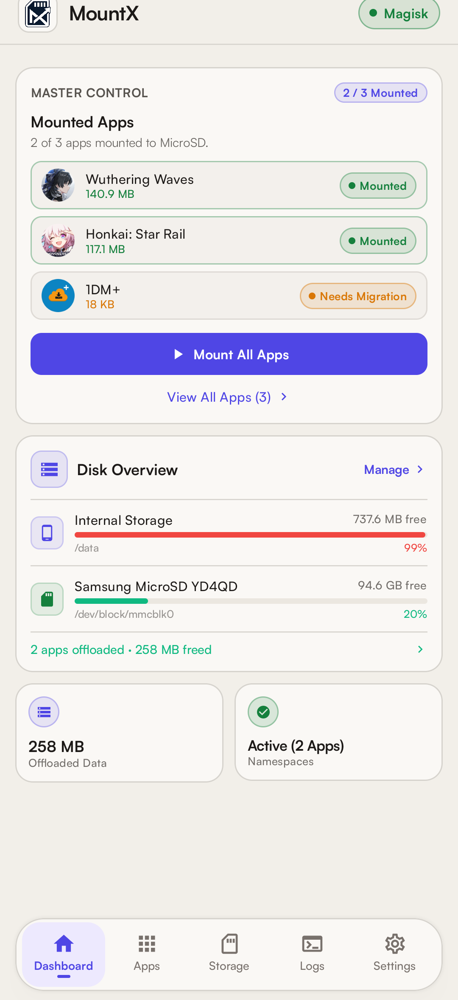
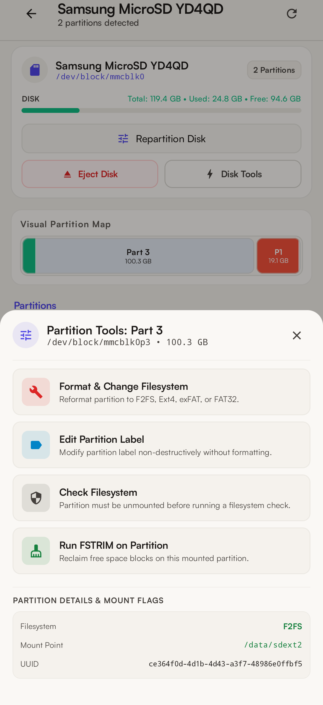
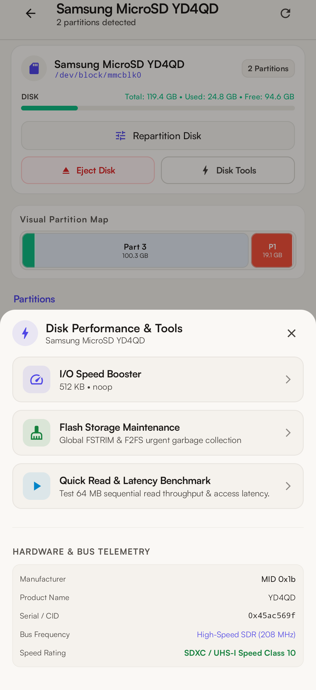
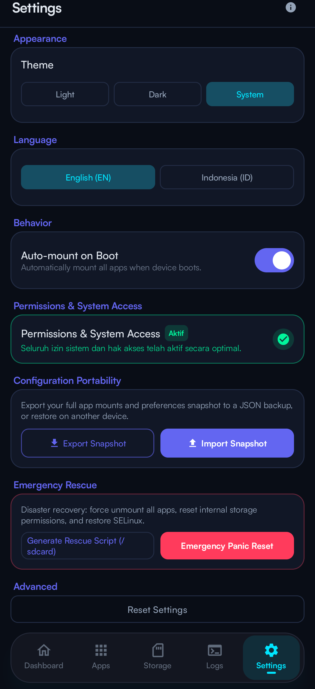

<div align="center">


# MountX

**Granular Storage Offloader & Native Bind-Mount Engine for Android**

[](https://github.com/Zy0x/MountX/releases)
[](https://github.com/Zy0x/MountX/actions)
[](https://developer.android.com)
[](https://github.com/topjohnwu/Magisk)
[](LICENSE)

<br/>

Free up 30 GB to 80 GB of internal storage per game.<br/>
MountX redirects heavy asset bundles and expansion packs to MicroSD cards, external SSDs, or USB OTG drives using Linux kernel VFS bind-mounts.

<br/>

[**Download APK & Module**](https://github.com/Zy0x/MountX/releases/latest) &nbsp;&bull;&nbsp; [**Documentation Wiki**](https://github.com/Zy0x/MountX/wiki) &nbsp;&bull;&nbsp; [**Report an Issue**](https://github.com/Zy0x/MountX/issues)

<br/>

<p align="center">
  
  &nbsp;&nbsp;&nbsp;&nbsp;&nbsp;&nbsp;&nbsp;&nbsp;
  
</p>

<sub><b>AMOLED Cyber Dark</b> &bull; <b>Soft Warm Sandstone Light</b></sub>

</div>

<br/>

<details>
<summary><b>📸 &nbsp;Explore More Screenshots (Storage Breakdown, Disk Tools, Partition Formatter, Settings)</b></summary>
<br/>

<table align="center" width="100%">
  <tr>
    <td align="center" width="25%">
      <a href="docs/screenshots/real/03_app_storage_breakdown.png"></a>
      <br/><sub><b>Granular Storage Breakdown</b></sub>
    </td>
    <td align="center" width="25%">
      <a href="docs/screenshots/real/04_apps_light.png"></a>
      <br/><sub><b>Apps Manager (Light)</b></sub>
    </td>
    <td align="center" width="25%">
      <a href="docs/screenshots/real/05_disk_management.png"></a>
      <br/><sub><b>Visual Partition Map</b></sub>
    </td>
    <td align="center" width="25%">
      <a href="docs/screenshots/real/06_partition_tools.png"></a>
      <br/><sub><b>Partition Tools & Formatter</b></sub>
    </td>
  </tr>
  <tr>
    <td align="center" width="25%">
      <a href="docs/screenshots/real/07_disk_performance.png"></a>
      <br/><sub><b>I/O Booster & Telemetry</b></sub>
    </td>
    <td align="center" width="25%">
      <a href="docs/screenshots/real/08_settings_dark.png"></a>
      <br/><sub><b>Settings & Portability</b></sub>
    </td>
    <td width="25%"></td>
    <td width="25%"></td>
  </tr>
</table>

</details>

---

### Why MountX?

Modern Android titles (*Wuthering Waves*, *Genshin Impact*, *Honkai: Star Rail*) demand massive storage. Android's user-space FUSE layer blocks traditional symlinking or moving, throwing `EXDEV: Cross-device link` errors.

MountX operates directly at the **Linux kernel VFS layer** using global namespace bind-mounts:

```
Game Process  ──[ Native Path ]──►  Kernel VFS Bind-Mount  ──┬──►  Internal Storage  (SQLite DBs & Credentials)
                                                            └──►  External Storage  (50 GB+ Textures & OBB)
```

| Feature | Legacy App2SD | Adoptable Storage | MountX |
| :--- | :---: | :---: | :--- |
| **Android 10–16 Support** | No (Broken by scoped storage) | Deprecated / locked | **Full support across all ROMs** |
| **Database Integrity** | High risk of SQLite corruption | Slow encrypted I/O | **Databases stay safe in internal flash** |
| **Performance** | High random read latency | Degrades entire device | **Zero overhead, native hardware speed** |
| **Storage Media** | MicroSD only | MicroSD only | **MicroSD, External SSD, USB-C OTG, NVMe** |
| **Filesystems** | FAT32 / Ext2 | Encrypted Ext4 | **F2FS (Optimized), Ext4, exFAT, FAT32** |
| **Root Frameworks** | Outdated SuperSU | None | **Magisk, KernelSU, APatch (via libsu)** |

---

### Granular Storage Architecture

MountX divides an application's files into discrete components. You only offload what consumes space:

| Storage Component | Default Path | MountX Location | Rationale |
| :--- | :--- | :---: | :--- |
| **Asset Bundles** | `Android/data/<package>` | **External Media** | Frees 30–80 GB per game |
| **Expansion Packs** | `Android/obb/<package>` | **External Media** | Offloads large expansion archives |
| **Custom Directories** | User-defined paths | **External Media** | For emulators, standalone loaders, offline data |
| **Binaries & Libraries** | `/data/app/...` | **Internal Flash** | Keeps instant app launch speed |
| **Databases & Keys** | `/data/data/<package>` | **Internal Flash** | Prevents SQLite lockups and save corruption |
| **Shader & Cache** | `/data/data/.../cache` | **Internal Flash** | Ephemeral compile cache stays fast |

---

### Key Capabilities

* **Kernel VFS Bind-Mount Engine**<br/>
  Transparent filesystem redirection using Linux kernel bind-mounts. Games read and write as if assets are still on internal storage.

* **Integrated Storage & Partition Manager**<br/>
  Auto-detects MicroSD cards (`mmcblk*`), external SSDs (`sd*`), and NVMe devices. Built-in partition formatter supporting **F2FS**, **Ext4**, **exFAT**, and **FAT32** with safety verification and filesystem checking (`fsck`).

* **Kernel I/O Queue Optimizer**<br/>
  Tune block device read-ahead buffers (up to 2048 KB) and choose I/O schedulers (`noop`, `deadline`, `kyber`, `bfq`) applied at boot for maximum sequential asset streaming.

* **Universal Root Compatibility**<br/>
  Built on `libsu` with zero vendor lock-in. Works cleanly with **Magisk**, **KernelSU**, and **APatch**. Companion late-boot service (`service.sh`) restores all mounts before user apps launch.

* **Configuration Portability & Safety**<br/>
  Export your entire mount configuration as a single JSON snapshot. Built-in panic rescue script generator (`/sdcard/mountx_panic_reset.sh`) ensures recovery in any emergency.

---

### System Requirements

| Requirement | Specification |
| :--- | :--- |
| **Android Version** | Android 10 to Android 16 (API 29–36) |
| **Root Environment** | Magisk 24.0+, KernelSU 0.9.0+, or APatch 10.0+ |
| **Target Storage** | MicroSD card, External SSD, or USB-C OTG flash drive |
| **Recommended Filesystem** | **F2FS** or **Ext4** (recommended for POSIX permissions and flash endurance). **exFAT** and **FAT32** are also supported. |

---

### Quick Start

1. **Flash Module**: Download `MountX-Magisk-v<version>.zip` from [Releases](https://github.com/Zy0x/MountX/releases/latest). Flash it in Magisk, KernelSU, or APatch, then reboot.
2. **Install App**: Install `MountX-v<version>.apk` and grant Superuser access on first launch.
3. **Offload Data**: Open the **Apps** tab, select your game, tap **Kelola Penyimpanan**, choose categories (e.g. Data Aplikasi / OBB), and tap **Pindahkan**.

---

### Documentation

Comprehensive technical documentation is available in the repository and the [MountX Wiki](https://github.com/Zy0x/MountX/wiki):

* [Installation Guide](docs/INSTALL.md) &mdash; Detailed flashing, root setup, and troubleshooting.
* [User Guide](docs/USAGE.md) &mdash; Interface overview, partition tools, and I/O parameters.
* [FAQ & Troubleshooting](docs/FAQ.md) &mdash; Common questions, crash prevention, and card tips.
* [Contributing Guide](docs/CONTRIBUTING.md) &mdash; Code conventions, building, and PR guidelines.
* [Changelog](CHANGELOG.md) &mdash; Complete release history.

---

### Support & Donations

MountX is free and open-source. If it helped you save storage, consider supporting development:

| Platform | Link |
| :--- | :--- |
| ☕ **Ko-fi** | [Support on Ko-fi](https://ko-fi.com/Zy0x) |
| 💳 **PayPal** | [Donate via PayPal](https://paypal.me/Zy0x) |
| 🇮🇩 **Saweria** | [Dukung via Saweria](https://saweria.co/Zy0x) |

---

### License

Distributed under the [MIT License](LICENSE).

Developed and maintained by **Noir** ([@Zy0x](https://github.com/Zy0x)).
