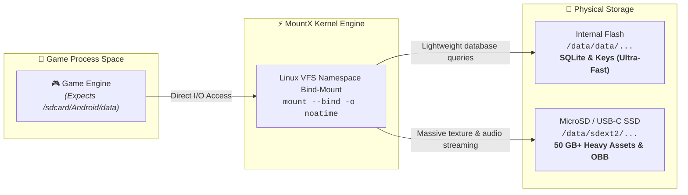

<div align="center">


# MountX

### Granular Storage Offloader & Native Bind-Mount Engine for Android

[](https://github.com/Zy0x/MountX/releases)
[](https://github.com/Zy0x/MountX/actions)
[](https://developer.android.com)
[](https://github.com/topjohnwu/Magisk)
[](LICENSE)

<br/>

**Free up 30 GB to 80 GB per game on your internal phone memory.**<br/>
MountX redirects heavy game asset bundles and expansion packs to high-speed MicroSD cards, external USB-C SSDs, or OTG storage using transparent Linux kernel bind-mounts.

[**Download Latest APK & Module**](https://github.com/Zy0x/MountX/releases/latest) • [**Read the Wiki**](https://github.com/Zy0x/MountX/wiki) • [**Report Bug**](https://github.com/Zy0x/MountX/issues)

</div>

---

## ⚡ How It Works

Modern games (*Wuthering Waves*, *Genshin Impact*, *Honkai: Star Rail*) exceed 40–80 GB each. Android's user-space FUSE layer blocks direct symlinking or file moving, triggering `EXDEV: Cross-device link` errors.

MountX bypasses user-space limitations by operating directly at the **Linux kernel VFS layer**:



---

## 🆚 Why MountX?

| Capability | Legacy App2SD / Link2SD | Android Adoptable Storage | 🚀 MountX |
| :--- | :---: | :---: | :--- |
| **Android 10–16 Compatibility** | ❌ Broken by scoped storage | ❌ Deprecated / format-locked | ✅ **Native support across all ROMs** |
| **Database & Save Stability** | ⚠️ High SQLite corruption risk | ⚠️ Slow encrypted database I/O | 🛡️ **Databases stay safe in internal flash** |
| **Game Loading Speed** | 🐌 Bottlenecked by random I/O | 🐌 Sluggish overall system | ⚡ **Full sequential hardware throughput** |
| **Storage Targets** | MicroSD only | MicroSD only (formats whole card) | 💾 **MicroSD, External SSD, USB-C OTG, NVMe** |
| **Supported Filesystems** | Outdated FAT32 / Ext2 | Proprietary encrypted Ext4 | ⚡ **F2FS (Flash-optimized), Ext4, exFAT** |
| **Root Frameworks** | SuperSU (Dead) | None | 🤖 **Magisk, KernelSU, APatch (via libsu)** |

---

## 📱 Screenshots

<table align="center">
  <tr>
    <td align="center" width="25%">
      <a href="docs/screenshots/real/01_dashboard_dark.png"></a><br/>
      <sub><b>Master Control (Dark)</b><br/>One-tap mount & namespace stats</sub>
    </td>
    <td align="center" width="25%">
      <a href="docs/screenshots/real/02_dashboard_light.png"></a><br/>
      <sub><b>Master Control (Light)</b><br/>Soft warm Sandstone light theme</sub>
    </td>
    <td align="center" width="25%">
      <a href="docs/screenshots/real/03_app_storage_breakdown.png"></a><br/>
      <sub><b>Granular Breakdown</b><br/>Visual ring chart & category selector</sub>
    </td>
    <td align="center" width="25%">
      <a href="docs/screenshots/real/04_apps_light.png"></a><br/>
      <sub><b>Apps Manager (Light)</b><br/>Per-game mount status toggles</sub>
    </td>
  </tr>
  <tr>
    <td align="center" width="25%">
      <a href="docs/screenshots/real/05_disk_management.png"></a><br/>
      <sub><b>Disk & Partitions</b><br/>Visual partition map & telemetry</sub>
    </td>
    <td align="center" width="25%">
      <a href="docs/screenshots/real/06_partition_tools.png"></a><br/>
      <sub><b>Partition Formatter</b><br/>F2FS / Ext4 / exFAT formatting</sub>
    </td>
    <td align="center" width="25%">
      <a href="docs/screenshots/real/07_disk_performance.png"></a><br/>
      <sub><b>I/O Speed Booster</b><br/>Queue tuning & read benchmark</sub>
    </td>
    <td align="center" width="25%">
      <a href="docs/screenshots/real/08_settings_dark.png"></a><br/>
      <sub><b>Settings & Safety</b><br/>Snapshot portability & emergency reset</sub>
    </td>
  </tr>
</table>

---

## 🎯 Granular Storage Architecture

MountX divides an application's storage into discrete modules so you only offload what makes sense:

```
App Storage Tree
├── 📦 APK Packages (/data/app/...)              ──► [STAY INTERNAL] Instant launch speed
├── ⚙️ Native Libraries (/data/app/.../lib)       ──► [STAY INTERNAL] Zero bus overhead
├── 🔑 Private Data (/data/data/<package>)        ──► [STAY INTERNAL] SQLite databases & credentials
├── 🧹 Shader & App Cache (.../cache)             ──► [STAY INTERNAL] Ephemeral compile buffer
├── 📂 Data Aplikasi (Android/data/<package>)     ──► [OFFLOAD TO EXTERNAL] 30–80 GB asset packs
├── 🎮 OBB Archives (Android/obb/<package>)       ──► [OFFLOAD TO EXTERNAL] Game expansion archives
└── 📁 Custom Folders (User-defined paths)        ──► [OFFLOAD TO EXTERNAL] Emulators, ROMs, maps
```

---

## ✨ Features at a Glance

| Feature | Technical Details | Target Benefit |
| :--- | :--- | :--- |
| **🎯 Granular Category Offloading** | Selectively migrate asset directories while keeping SQLite internal | Zero database locks, no crash loops |
| **⚡ Native Kernel Bind-Mount** | `mount --bind` via Linux VFS with global namespace propagation | Transparent filesystem redirection |
| **🛠️ Integrated Partition Tools** | Format block devices to **F2FS**, **Ext4**, **exFAT**, or **FAT32** with safety verification | Direct partition management in-app |
| **🚀 Kernel I/O Speed Booster** | Sysfs read-ahead buffer tuning (up to 2048 KB) and scheduler selection | Maximized sequential asset streaming |
| **🔍 Hardware Telemetry & Benchmarks** | Read CID, vendor ID, bus frequency (up to 208 MHz SDR), and speed tests | Validate genuine card performance |
| **🤖 Root Framework Agnostic** | Built with `libsu` for Magisk, KernelSU, and APatch compatibility | Works across standard root setups |
| **🔄 Automated Boot Service** | Magisk/KSU late-start boot daemon mounts partitions before app startup | Seamless hands-free reboots |
| **📦 JSON Snapshot Portability** | Export and import full app mount configurations as single-file JSON | Fast backup across ROM updates |
| **🚨 Emergency Rescue System** | Generates standalone recovery script (`/sdcard/mountx_panic_reset.sh`) | Failsafe one-click disaster recovery |

---

## 📋 System Requirements

| Component | Supported Range | Recommendation |
| :--- | :--- | :--- |
| **Android OS** | Android 10 to Android 16 (API 29–36) | Latest stable Android version |
| **Root Environment** | Magisk 24.0+ • KernelSU 0.9.0+ • APatch 10.0+ | Any root manager using `libsu` |
| **Target Storage** | MicroSD card • External USB-C SSD/HDD • USB OTG | UHS-I U3 / A2 MicroSD or USB 3.2 SSD |
| **Partition Filesystem** | **F2FS** • **Ext4** • **exFAT** • **FAT32** | **F2FS or Ext4** for native POSIX permissions |

---

## 🚀 Quick Start in 3 Steps

### 1️⃣ Flash the Companion Module
Download `MountX-Magisk-v<version>.zip` from [GitHub Releases](https://github.com/Zy0x/MountX/releases/latest). Flash the zip in your root manager (**Magisk**, **KernelSU**, or **APatch**) and reboot.

### 2️⃣ Install the MountX App
Install `MountX-v<version>.apk` and launch it. Grant Superuser privileges when prompted.

### 3️⃣ Select & Offload Game Data
1. Open the **Apps** tab and tap on your target game.
2. Tap **Kelola Penyimpanan**.
3. Choose the storage categories to offload (e.g. **Data Aplikasi** and **OBB**).
4. Select your target partition and tap **Pindahkan**. The bind-mount activates immediately.

---

## 📚 Technical Documentation Hub

Comprehensive guides are available in the repository and the [MountX GitHub Wiki](https://github.com/Zy0x/MountX/wiki):

| Guide | Description |
| :--- | :--- |
| 📖 **[Installation Guide](docs/INSTALL.md)** | Step-by-step flashing, root grant, initial storage setup, and error codes |
| 📖 **[User Manual](docs/USAGE.md)** | Detailed walk-through of all 5 tabs, partition tools, I/O parameters, and backups |
| ❓ **[FAQ & Troubleshooting](docs/FAQ.md)** | Common issues, card selection, crash prevention, and emergency recovery |
| 💻 **[Contributing Guide](docs/CONTRIBUTING.md)** | Codebase architecture, Jetpack Compose conventions, and pull request rules |
| 📝 **[Changelog](CHANGELOG.md)** | Complete version history and release notes |

---

## 🛠️ Build from Source

MountX is built using Kotlin and Jetpack Compose. JDK 17 is required.

```powershell
# Clone the repository
git clone https://github.com/Zy0x/MountX.git
cd MountX

# Build signed Release APK
.\gradlew.bat assembleRelease

# Release APK location:
# app/build/outputs/apk/release/app-release.apk
```

For keystore setup and release signing parameters, see [KEYSTORE_SETUP.md](KEYSTORE_SETUP.md).

---

## ☕ Support the Project

MountX is completely free and open-source. If it saved your internal storage, consider supporting ongoing maintenance:

| Platform | Link |
| :--- | :--- |
| ☕ **Ko-fi** | [Support on Ko-fi](https://ko-fi.com/Zy0x) |
| 💳 **PayPal** | [Donate via PayPal](https://paypal.me/Zy0x) |
| 🇮🇩 **Saweria** | [Dukung via Saweria](https://saweria.co/Zy0x) |

---

## 📄 License

MountX is open-source software licensed under the [MIT License](LICENSE).

Crafted with care by **Noir** ([@Zy0x](https://github.com/Zy0x)).
