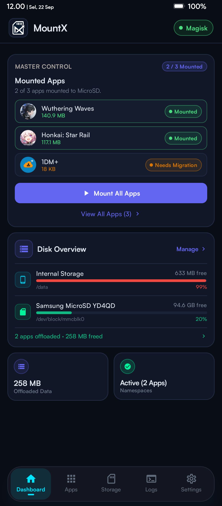
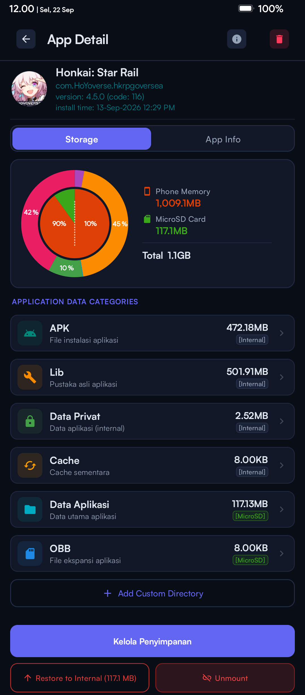
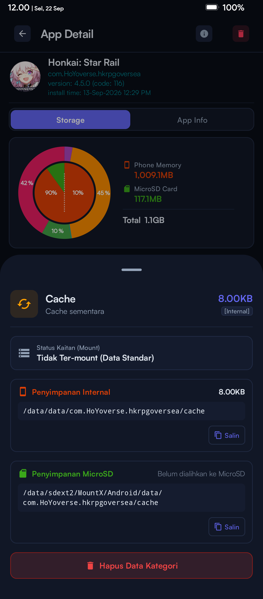
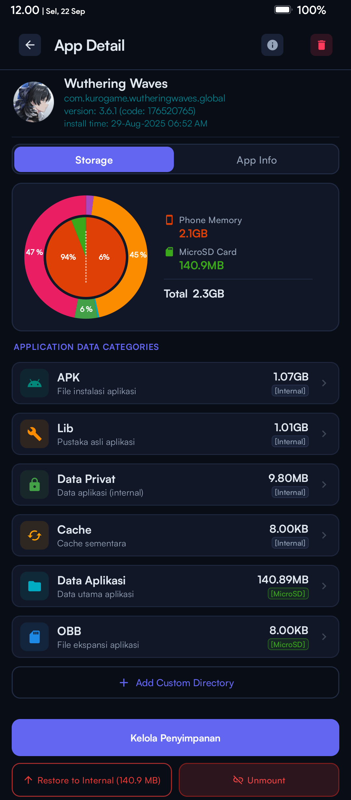
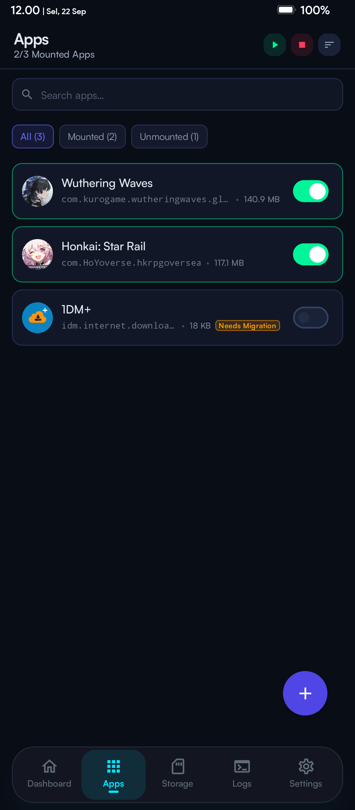
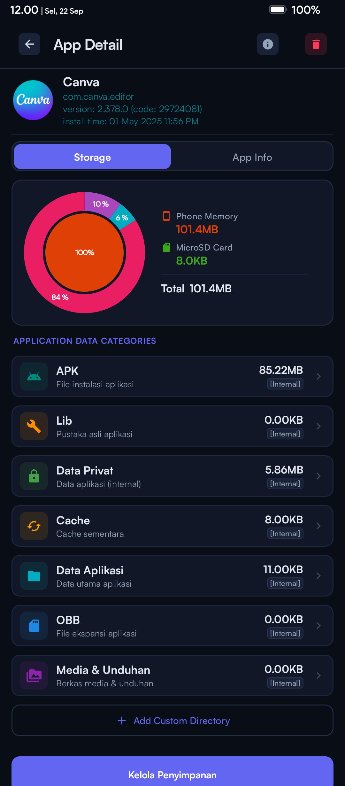
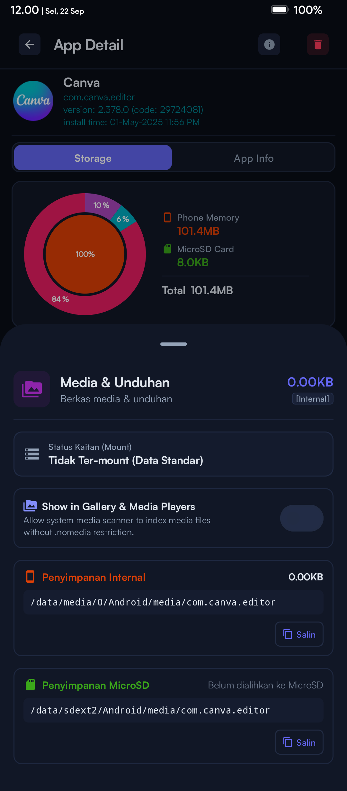
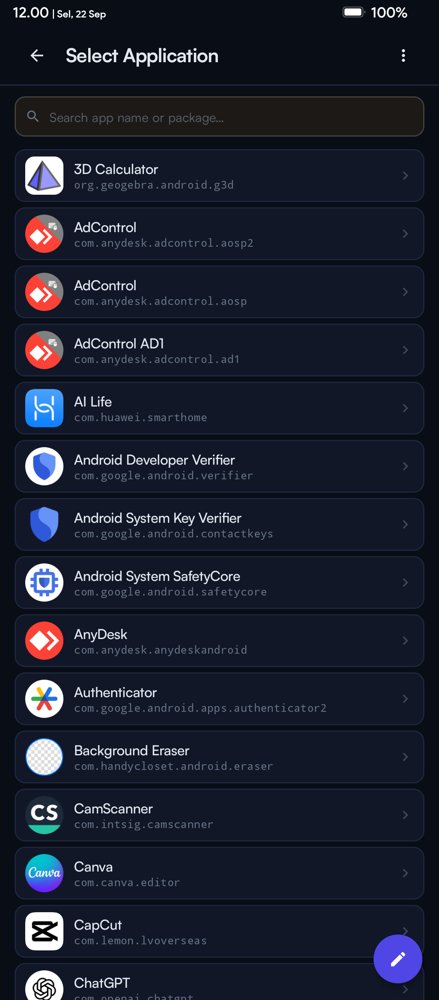

<div align="center">


# MountX

**Move your games to MicroSD — without FUSE errors.**

[](https://github.com/Zy0x/MountX/actions/workflows/build.yml)
[-brightgreen.svg)](https://developer.android.com)
[](LICENSE)
[](https://github.com/Zy0x/MountX/releases/latest)

</div>


## What is MountX?

MountX is a native Android app + Magisk module that moves large game data (Wuthering Waves, Genshin Impact, Honkai: Star Rail, PUBG Mobile, and more) from internal storage to a dedicated MicroSD or Eksternal Disk (SSD Eksternal, USB OTG, etc) partition using kernel-level bind-mounts. Unlike FUSE-based solutions, MountX operates at the filesystem layer — no cross-device copy errors, no performance penalties. Supports Android 10–16 with Magisk, KernelSU, or APatch.

---

## Features

- **Bind-Mount Engine** — Transparent filesystem redirection using kernel bind-mounts. Games run from MicroSD as if nothing changed.
- **Two Mount Modes** — `PKG` mode mounts the entire `Android/data/<package>` directory; `FILES` mode mounts only the `files` subdirectory, keeping the database on internal storage.
- **Physical Data Migration** — Safe, verified transfer of game data between internal storage and MicroSD with integrity checks.
- **Partition Tools** — Auto-detect block devices (`mmcblk*`, `sd*`), format partitions to F2FS or Ext4, run read/write benchmarks.
- **I/O Booster** — Kernel block queue tuning (read-ahead, I/O scheduler, VFS cache pressure) applied at boot for maximum MicroSD throughput.
- **Real-time Log Viewer** — Live tail of mount activity with color-coded log levels.
- **Backup & Restore** — Export and import your app configuration as JSON.
- **Root Framework Agnostic** — Works with Magisk, KernelSU, and APatch via `libsu`.
- **Material Design 3** — Dynamic Color, AMOLED dark mode, and full light mode support.
- **Multi-language** — English and Indonesian (Bahasa Indonesia) built-in.

---

## Screenshots

### Dark Mode

<table>
  <tr>
    <td align="center"><br/><b>Dashboard</b></td>
    <td align="center"><br/><b>Storage Overview</b></td>
    <td align="center"><br/><b>Disk Detail</b></td>
  </tr>
  <tr>
    <td align="center"><br/><b>Disk Tools</b></td>
    <td align="center"><br/><b>Partition Tools</b></td>
    <td align="center"><br/><b>Apps & Games</b></td>
  </tr>
  <tr>
    <td align="center"><br/><b>App Storage Detail</b></td>
    <td align="center"><br/><b>Live Logs</b></td>
    <td align="center"><br/><b>Settings</b></td>
  </tr>
  <tr>
    <td align="center"><br/><b>About</b></td>
    <td></td>
    <td></td>
  </tr>
</table>

### Light Mode

<table>
  <tr>
    <td align="center"><br/><b>Storage (Light)</b></td>
    <td align="center"><br/><b>Apps & Games (Light)</b></td>
    <td align="center"><br/><b>App Detail (Light)</b></td>
  </tr>
  <tr>
    <td align="center"><br/><b>Settings (Light)</b></td>
    <td></td>
    <td></td>
  </tr>
</table>

---

## Requirements

1. **Rooted Android device** — Magisk, KernelSU, or APatch.
2. **Android 10–16** (API 29–36).
3. **MicroSD card or Eksternal Disk** with a dedicated second partition (the app auto-detects block devices; configurable in Settings).
4. **Partition filesystem** must be **F2FS** or **Ext4** (exFAT/FAT32 are not supported for bind-mounts).

---

## Quick Install

**Step 1 — Download**

Go to [GitHub Releases](https://github.com/Zy0x/MountX/releases/latest) and download:
- `MountX-Magisk-vX.X.X.zip` — the root module
- `MountX-vX.X.X.apk` — the companion app

**Step 2 — Flash the module**

Open your root manager (Magisk / KernelSU / APatch), flash the downloaded `.zip`, then **reboot**.

**Step 3 — Install and configure the app**

Install the APK, open MountX, grant root permission when prompted, and configure your MicroSD partition path in **Settings → SD Partition**.

> For a detailed walkthrough, see [docs/INSTALL.md](docs/INSTALL.md).

---

## Build from Source

```bash
# Clone the repository
git clone https://github.com/Zy0x/MountX.git
cd MountX

# Build a signed release APK (requires keystore.properties)
.\gradlew.bat assembleRelease
# Output: app/build/outputs/apk/release/app-release.apk
```

> See [KEYSTORE_SETUP.md](KEYSTORE_SETUP.md) for signing configuration, and [docs/CONTRIBUTING.md](docs/CONTRIBUTING.md) for the full developer guide.

---

## Documentation

| Document | Description |
|---|---|
| [INSTALL.md](docs/INSTALL.md) | Full installation guide, prerequisites, and troubleshooting |
| [USAGE.md](docs/USAGE.md) | User manual — all features explained |
| [FAQ.md](docs/FAQ.md) | Common questions and answers |
| [CONTRIBUTING.md](docs/CONTRIBUTING.md) | Developer guide — how to build, contribute, and submit PRs |
| [CHANGELOG.md](CHANGELOG.md) | Full version history |

---

## Support the Project

MountX is free and open-source. If it saves your internal storage, consider buying me a coffee:

| Platform | Link |
|---|---|
| ☕ Ko-fi | [ko.fi/Zy0x](https://ko.fi/Zy0x) *(placeholder)* |
| 💳 PayPal | [paypal.me/Zy0x](https://paypal.me/Zy0x) *(placeholder)* |
| 🇮🇩 Saweria | [saweria.co/Zy0x](https://saweria.co/Zy0x) *(placeholder)* |

---

## License

Licensed under the [MIT License](LICENSE).

**Author:** Noir ([@Zy0x](https://github.com/Zy0x))
