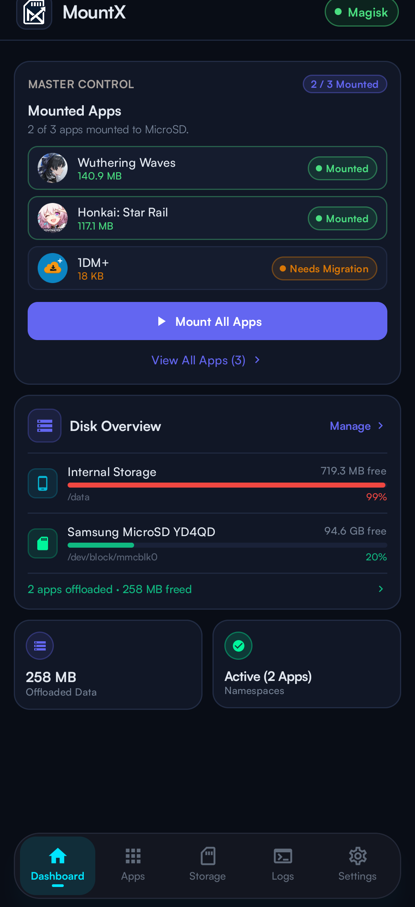
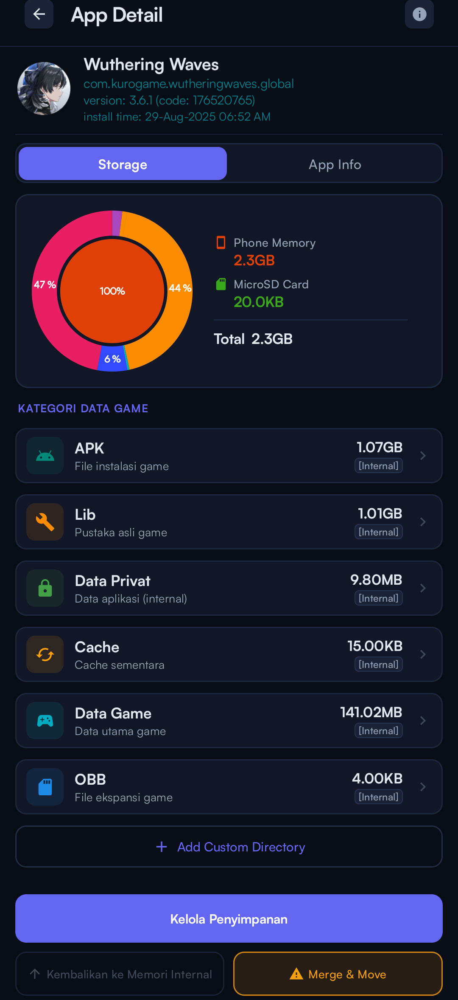
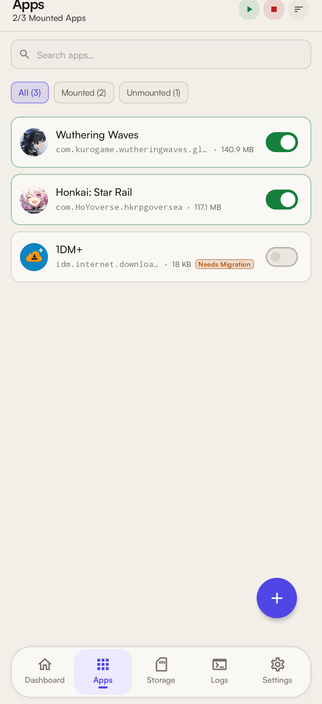
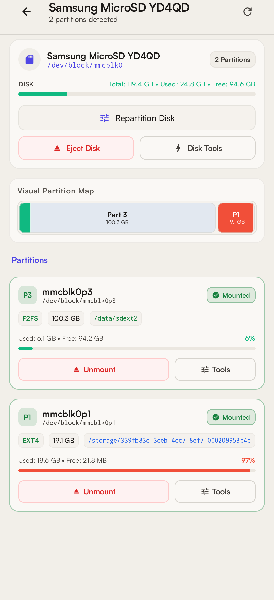

# MountX

### Move massive Android games to MicroSD or USB storage with zero lag, zero crashes, and zero reinstallation.

 

Running out of space from 50 GB+ games like *Wuthering Waves*, *Genshin Impact*, or *Honkai: Star Rail*?

**MountX** safely moves heavy game files to your MicroSD card, external SSD, or USB drive while keeping the phone convinced they are still on internal storage. Your games run at full speed, updates work normally, and your save data is never touched.

 

[**Download APK & Module**](https://github.com/Zy0x/MountX/releases/latest) &nbsp;&bull;&nbsp; [**Getting Started**](#quick-start) &nbsp;&bull;&nbsp; [**Documentation Wiki**](https://github.com/Zy0x/MountX/wiki)

 

<table align="center">
  <tr>
    <td align="center" width="25%">
       
      <b>Master Control</b>
    </td>
    <td align="center" width="25%">
       
      <b>Storage Breakdown</b>
    </td>
    <td align="center" width="25%">
       
      <b>Apps Manager</b>
    </td>
    <td align="center" width="25%">
       
      <b>Partition Manager</b>
    </td>
  </tr>
</table>

 

## 🎯 What You Get

* **Reclaim 30 GB to 80 GB per Game** 
  Move massive texture packs, audio files, and cutscenes to your external storage and free up your precious internal memory for photos, videos, and daily apps.

* **Native Hardware Speed & Zero Lag** 
  Unlike old moving methods that caused stutter, games load assets directly through native storage channels without performance loss.

* **Safe by Design: Zero Risk of Data Loss** 
  Your login sessions, saved progress, and app databases stay safe on internal storage. Only the heavy, replaceable asset files are moved.

* **Automatic Boot Restoration** 
  Reboot your phone whenever you want. MountX automatically restores all game mounts in the background before you even unlock your screen.

* **Beautiful Dark & Light Themes** 
  Features a high-contrast AMOLED Cyber Dark theme and a soft Sandstone Light theme that adapts to your system setting.

 

## 🛠️ Technical Highlights

For power users and developers interested in the implementation:

* **Kernel VFS Bind-Mounts**: Direct filesystem redirection with global namespace propagation, bypassing user-space FUSE overhead and `EXDEV` errors.
* **Granular Category Offloading**: Selectively offload game assets (`Android/data`), expansion files (`Android/obb`), or custom folders while keeping SQLite databases in `/data/data`.
* **Integrated Partition Formatter**: Format and manage **F2FS**, **Ext4**, **exFAT**, and **FAT32** partitions directly within the app, complete with filesystem checking (`fsck`).
* **Kernel I/O Speed Booster**: Automatically tunes sysfs block queue parameters (read-ahead cache buffer up to 2048 KB, I/O schedulers) at boot.
* **Universal Root Compatibility**: Powered by `libsu`, working identically across **Magisk**, **KernelSU**, and **APatch**.

> 📖 **Curious about how it works under the hood?** 
> Read our full technical breakdown in **[Architecture & Internals](docs/ARCHITECTURE.md)**.

 

## 📋 Requirements

* **Root Access**: Magisk 24+, KernelSU 0.9+, or APatch 10+
* **Android OS**: Android 10 to Android 16 (API 29–36)
* **Storage Media**: MicroSD card, External USB-C SSD, or USB OTG drive
* **Filesystem**: **F2FS** or **Ext4** recommended for native POSIX permissions. **exFAT** and **FAT32** are also supported.

 

## 🚀 Quick Start

1. **Flash Module**: Download `MountX-Magisk-v<version>.zip` from [GitHub Releases](https://github.com/Zy0x/MountX/releases/latest). Flash it in your root manager and reboot.
2. **Install App**: Install `MountX-v<version>.apk` and grant Superuser permission when prompted.
3. **Move Game Data**: Open the **Apps** tab, tap your game, tap **Kelola Penyimpanan**, select the asset categories to move, and tap **Pindahkan**.

 

## 📚 Documentation

Detailed guides and manuals are available in the repository and the [MountX Wiki](https://github.com/Zy0x/MountX/wiki):

* [Installation Guide](docs/INSTALL.md) : Prerequisites, root setup, and configuration.
* [User Guide](docs/USAGE.md) : Interface overview, partition tools, and storage management.
* [Architecture & Internals](docs/ARCHITECTURE.md) : Deep technical dive into kernel namespaces, VFS bind-mounts, and I/O tuning.
* [FAQ & Troubleshooting](docs/FAQ.md) : Common questions, crash prevention, and error solutions.
* [Contributing Guide](docs/CONTRIBUTING.md) : Developer guide, code style, and pull request workflow.
* [Changelog](CHANGELOG.md) : Full release and version history.

 

## ❤️ Support the Project

MountX is free and open-source. If it helped you save storage, consider supporting ongoing development:

* ☕ **Ko-fi**: [Support on Ko-fi](https://ko-fi.com/Zy0x)
* 💳 **PayPal**: [Donate via PayPal](https://paypal.me/Zy0x)
* 💰 **Saweria**: [Dukung via Saweria](https://saweria.co/Zy0x)

 

## 📄 License

MountX is licensed under the [MIT License](LICENSE).

Developed and maintained by **Noir** ([@Zy0x](https://github.com/Zy0x)).
